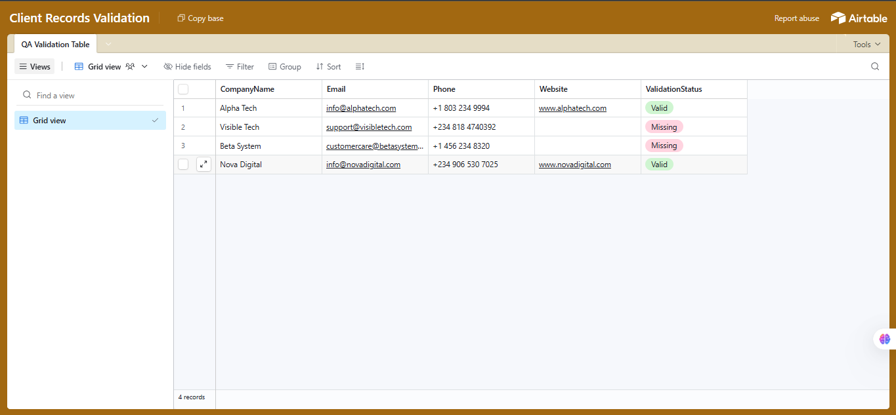
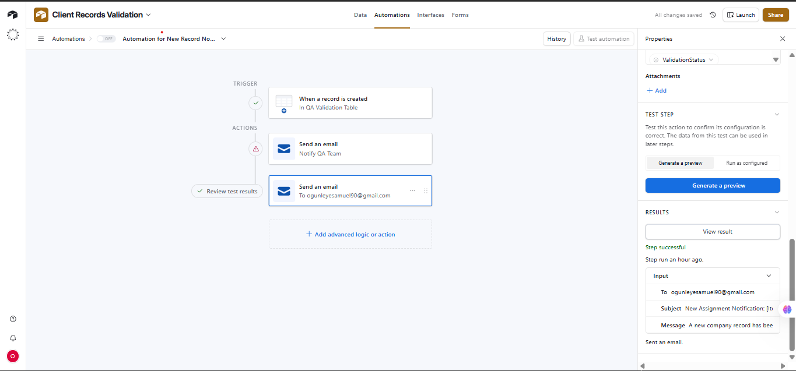
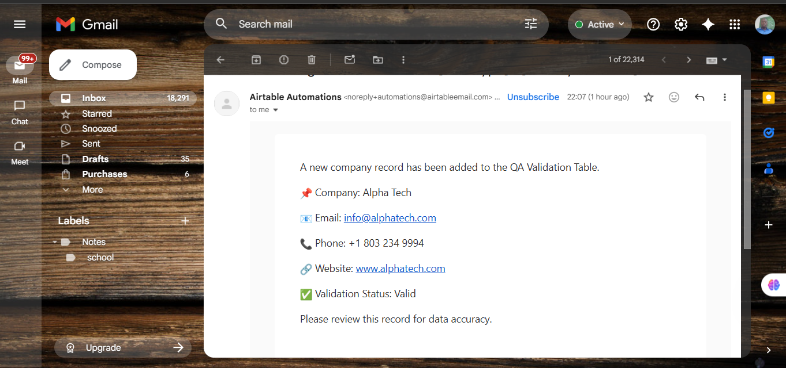

# Airtable-automation-demo
airtable-automation-demo

# Airtable Automation Demo

This project demonstrates how Airtable automation can send real-time email notifications when new records are added.  
It’s designed as a lightweight automation showcase that integrates Airtable workflows with external tools or APIs.

## 🔧 Features
- Automated email notifications for new records
- Custom table fields: Name, Phone, Website, ValidationStatus, Email
- Triggered workflow for record creation
- Can be extended with external API connections (e.g. Zapier, Make, or custom FastAPI backend)

## 🧩 How It Works
1. A new record is created in Airtable.
2. Automation triggers an email notification with record details.
3. Optionally, the data can be pulled via Airtable API as JSON.

## 📡 API Reference
You can test it using Postman:

## 📸 Screenshots

### Airtable Table View


### Automation Setup


### Email Notification



```bash
GET https://airtable.com/appCR3yC15QBMH4vT/shrVIBIAClyckuAoT
